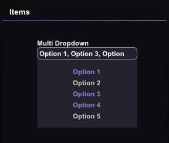

# ui
Provides general interaction between the GUI and the api.

## Functions
``.is_open()``

Returns whether or not the menu is open.

``.next_line()``

Creates an empty line.

!!! Warning
    When using GUI elements, you must have an ``ui.next_line()`` at the start, otherwise your elements will be too high up and clipping through the menu.

``.add_label(label: string)``

Creates a label with the given text.

``.add_checkbox(label: string)``

Creates a checkbox with the given text as the label.

``.add_int_slider(label: string, min: int, max: int)``

Creates an integer slider.

``.add_float_slider(label: string, min: float, max: float)``

Creates an float slider.

``.add_dropdown(label: string, choices: table)``

Creates a dropdown.

``.add_multi_dropdown(label: string, choices: table)``

Creates a multi-dropdown.

``.add_color_picker(label: string)``

Creates a color picker object.

Color pickers will be combined with checkboxes when succeeding them.

``.get_bool(label: string)``

Returns the value of a checkbox.

``.get_int(label: string)``

Returns the value of an integer slider.

Returns the selected option in a dropdown

``.get_float(label: string)``

Returns the value of a float slider.

``.get_color(label: string)``

Returns the [color](../Classes/color.md) of a color picker object.

``.get_dropdown(label: string)``

Returns a table representing the selected values of a multi-dropdown.

For example, this multi-dropdown:



will return this table:

| Index | Value |
|-------|-------|
|   1   |   1   |
|   2   |   0   |
|   3   |   1   |
|   4   |   1   |
|   5   |   0   |

``.set_bool(label: string, value: boolean)``

Sets the value of a checkbox.

``.set_int(label: string, value: integer)``

Sets the value of an integer slider or a dropdown.

``.set_float(label:string, value: float)``

Sets the value of a float slider.

``.set_color(label: string, value: color)``

Sets the color of a color picker.

!!! Warning
    This function does not work. Fuck your family White and Kyle!

``.get_keybind_state(bind: keybind)``

Returns whether or not the keybind is active or not.

``.get_keybind_mode(bind: keybind)``

Returns a 0(hold mode) or a 1(toggle mode).

## Keybinds

```
trigger_bot
legit_bot
double_tap
hide_shots
manual_back
manual_left
manual_right
inverter
third_person
peek_assist
edge_jump
fake_duck
slow_walk
body_aim
safe_points
rage_bot
auto_wall
freestanding
resolver_override
```